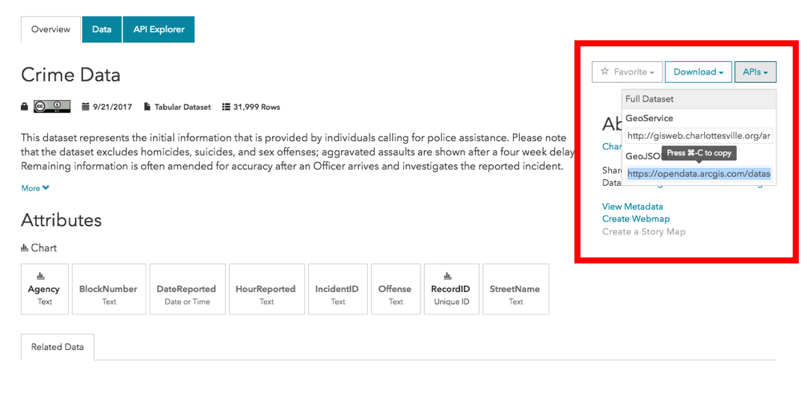

####

# Intro

This is a tutorial for interacting with the new [Charlottesville Open Data Portal](http://opendata.charlottesville.org/) in `R`. All of the tools are free, but since we will be relying on a bunch of pacakages, version numbers will be important. This anlysis is written with:

```{r, eval = FALSE}
RStudio: 1.1.331
R version 3.4.1 (2017-06-30)
Platform: x86_64-apple-darwin15.6.0 (64-bit)
Running under: macOS Sierra 10.12.6
```

Happy with getting people up and walking with R, just email [me](nathancday@gmail.com). Going forward I will include packages versions as code comments.

Our first task is so go into the Portal and retrieve the data (sounds like some scifi badassery). But don't worry its actually more like a copy and paste. In three lines of code we will pull down all of the City's police reports since 2012 (32,000 rows).

Our second task will be to geo-code, assign lattitude and longitude coordinates, to the data. And start to look at static visualizations of the data.

And our last but definatly coolest task wil be to upgrade your map (if [Xzhibit](https://www.youtube.com/watch?v=2dkN0YIBjEM) were here, you'd get a fish tank!) to be cool, interactive, and dynamic.

This walkthrough today is made possible by a lot of awesome packages, which we will better as they are needed. Disclosure: I really really like using `%>%`s (perhaps too much) so fair warning this analysis is framed within the `magrittr`-`tidyverse`.

```{r, message = FALSE}
library(tidyverse) # v_1.1.1
library(magrittr) # v_1.5; viva la %<>%
```

# API

Stands for "Application Program Interface", which is just a fancy speak for the framwork that allows data to be accessed by computer code. APIs are designed to make it easier for people to work with the services that they love and use and all big companies like Twitter, Google and Dropbox have their own APIs to allow coders access to their products with programs.

There are a couple of good reasons to use an API:

* Reproducibility
    + No more local file paths
    + Anyone with API access can pick up the same data
* Durability
    + Don't have to download lastet versions by hand
    + Consistant interface with web links (RestAPI)

For the [ODP](https://opendata.arcgis.com/datasets/d1877e350fad45d192d233d2b2600156_78.geojson) API you have two options 'GeoService' and 'GeoJSON'. I will be using 'GeoJSON' here because it is the only `https://` option and we want to be secure when transmitting data. To acccess the API, all we need to do is copy the link found in the API menu in the right side bar.

####


And paste into our new bestfriend `jsonlite::fromJSON()`

```{r fromJSON, message = FALSE}

library(jsonlite) #v_1.5
crime_json <- fromJSON("https://opendata.arcgis.com/datasets/d1877e350fad45d192d233d2b2600156_78.geojson")
```

While `json` format has a lot of useful properties, it is hard to read for humans. So having tools like [`library(jsonlite)`](https://arxiv.org/abs/1403.2805) makes working these files feasible, fast and maybe even fun.

Our read in returned a list with two elements, `$type` and `$features`. The data that we are after is in the second element `.$features` already packaged into a nice data frame! Let's look at the head of it now.

```{r head}
crime_df <- crime_json[["features"]]
head(crime_df)
```

If you are really paying attention you might realize that the dimensions of `crime_df` are 32000x3, not exactly what `head()` just showed us. Since the ODP Portal is built on GeoJSON, the data frame we get returned has that formats standard columns `type`, `properties` and `geometry`. In this case because we dowloaded a tabular data set with no 'GeoJSON' properties, the only column with useful information is `properties`. The `properties` column is a  "nested" column of 32,000 one row dataframes. Our friend `head()` just tried to help us out silently by printing out "nested" data frame column out as if it were "unnested" with all of the columns shown.

Later I will show an example where we use the API to access shape files, and then the `geometry` column will be what we are trying to get too. But for now lets use the doulbe bracket list extraction so `properties` can be a real 32000x8 dataframe.

```{r unnest}
crime_df <-  crime_df[[2]]
```

With only two lines of code we have accessed and pulled all of the Crime Data released by the Charlottesville Police Department to date on the ODP. This is exactly the same object we would have if you downloaded the 'csv' file from the ODP by hand and read it in using `readr::read_csv()` like I did in my [towing analysis](./tow_forecast.html).

# Geocode

Right now `crime_df` has columns about the type, time and location of police reports, but we don't have any latitude and longitude coordinates that would help us to plot this information on a map. Getting that coordinate information is pretty simple to do with `ggmap::geo_encode()`, but this does take some time and is restricted to a daily query limit if you want to use Google's MapAPI.

The [`library(ggmap)`](https://github.com/dkahle/ggmap), written by [David Kahle](http://www.kahle.io/), and makes it possible to work with popular online map tools in R, using the same syntax of layers as [`library(ggplot2)`](http://ggplot2.org/). The function `geo_encode()` allows us to send address queries to Google Map and ask if it can provide lat/lon coordinates for us. All we need to do now is build a full address (something full enough if you dropped it into the Google seach engine it would return a map) so we can feed the function.

```{r address}
crime_df$address <- paste(crime_df$BlockNumber, crime_df$StreetName, "Charlottesville VA")
```

This data only reports location down to the street block, and not the exact address in an effort to protect people's privacy, because after all these are just police reports, not actual crimes that people have been tried for and convicted of.

Because of this polite privacy screen, we undoubtedly have a bunch of redundant addresse in our year's worth of police reports. It doens't make sense to send a separte query for duplicate addresses, let's build a smaller dataframe with only the unique addresses as its only column.

```{r geo_df}
geo_df <- data.frame(address = unique(crime_df$address))
nrow(geo_df)
```

Only 3,206 unique address in our dataset, looks like we can get all of our plotting information with only 10% of the queries!!! That's great because running queries takes a noticable amount of time and if we want to use Google we'd have to run the first 2500 today and run the remainder tomorrow (unless we want pay 50¢/1000 queries).

Becasue I care about your time and mental wellness, I have uploaded a fully geo-coded version of `crime_df` on [Dropbox(](https://www.dropbox.com/s/5l2kol225wyts6l/CPDreports_Geocoded.csv?dl=0) as a 'csv' file. We will still go through the intermediate steps here, but if you ain't got time for that, skip ahead to the [Map section](#map) and download the pre-processed data.

```{r run it, eval = FALSE}
library(ggmap)
# split up into <2500 row chunks
query_lst <- split(geo_df, rep(1:2, each = 2499, length.out = nrow(geo_df)))
# run on separate days
latlon1 <- geocode(query_lst[[1]]$address, source = "google")
latlon2 <- geocode(query_lst[[2]]$address, source = "google")

all_latlon <- bind_rows(latlon1, latlon2)

```

Now would be a good time to save :)

I like using `saveRDS(object, "~/my/path/to/obj.RDS")` to save individuals R objects. By my crude calculations it takes approximately 1 second per address query so roughly 53 minutes to process 3,200 of them. Currently `all_latlon` has only the columns `lon` and `lat`, so we need to bind the result coordinates to the column of addresses used in our queries.

```{r binding, eval = FALSE}
library(tidyverse)
geocoded_df <- bind_cols(geo_df, all_latlon)

# check encoding
map(geocoded_df, ~ sum(is.na(.)))

# drop the 60 missed calls
geocoded_df %<>% filter(!is.na(lat))

```

Great now that we have all of the unique addresses geocoded we can merge out new latitude and longitude coordinates back into our entire data set `crime_df`. 

```{r, include = FALSE}
library(ggmap)
library(tidyverse)
geocoded_df <- readRDS("~/future/CvilleTowing/most_latlon.RDS")
geocoded_df %<>% filter(!is.na(lat))
gmp <- readRDS("~/future/CvilleTowing/gmp.RDS")
```

```{r join together again}
crime_df2 <- inner_join(crime_df, geocoded_df, by = "address")
nrow(crime_df)
```

We now have 31,893 police reports to map through. Let's start looking at them quickly to assess how accurate the geo-encoding was It's always inportant to check the quality of your data like this at check points in your analysis. Here we won't even use a map to out the encoding, just a standard `ggplot()`.

```{r ggplot qc}
ggplot2::ggplot(crime_df2, aes(lon, lat)) +
    geom_point(shape = 1)
```

We can see we have 104 rows with missing values, as well as some spurious results. Charlottesville's GPS coordinates are 38.0293° N, 78.4767° W, so it's pretty safe for us to trim any points outside of a +/- 0.5 degree margin around that.

```{r coord_filter}

crime_df2 %<>% filter(between(lon, -79.0, -78.0),
                     between(lat, 37.5, 38.5))

```

And lets look again, this time a little closer to home and use the main function `ggmap()` to introduce a map canvase for our plotting area. This function takes the place of the initial `ggplot()` and requires a 'map' object.
```{r eval = FALSE}
gmp <- get_map("Charlottesville VA") # another Google MapAPI query
```
```{r}
ggmap::ggmap(gmp) +
    geom_point(data = crime_df2, aes(lon, lat), shape = 1)
```

No we are ready to start putting our data onto a map and looking for patterns. This is where the 'CPDreports_GeoCoded.csv' file on [Dropbox](https://www.dropbox.com/s/5l2kol225wyts6l/CPDreports_Geocoded.csv?dl=0) are written out, so just head over there and save yourself the hour or API requests. accomadatating. Hopefully this data will be on the portal soon.

```{r write out, eval = FALSE}
write.csv2(crime_df, "CPDreports_GeoCoded.csv")
```

# Map

This a leaflet....

```{r leaflet}
library(leaflet)
leaflet() %>% # usually you would have data here
    addProviderTiles(provider = "OpenTopoMap") %>% # pick tiles for map background
    setView(lng = 0, lat = 0, zoom = 2)
```

[Leaflet](http://leafletjs.com/) is a wildly popular JavaScript library for interactive mapping, even ESRI (the group behind the tech of ODP and the sponsor of Boot Camp) has built a set of tool for [ArcGIS](https://esri.github.io/esri-leaflet/) analysis on top of it! Fortunatly for the R community, RStudio has made a port of the library to  which is an awesome addition to R's [plotting arsenal](https://rstudio.github.io/leaflet/).


Becasue plotting lots of points can really slow down the dynamic experience of Leaflet, let's start by plotting just the data from 2106.

```{r crime_leaf}
library(lubridate) # for easy time functions
crime2016 <- filter(crime_df2, year(DateReported) == "2016")
leaflet(crime2016) %>%
    addProviderTiles("Esri.WorldStreetMap") %>% # does that map look familiar?
    addCircleMarkers()
```

Thats a lot of data to look at, probably too much to be able to discrene pattern even if we added color coding. Leaflet offers a nice built in clustering algorithim that we can deploy with an option to `addCircleMarkers()`.

```{r crime_leaf}
library(lubridate) # for easy time functions
crime2016 <- filter(crime_df2, year(DateReported) == "2016")
leaflet(crime2016) %>%
    addProviderTiles("Esri.WorldStreetMap") %>%
    addCircleMarkers(clusterOptions = markerClusterOptions(),
                     label = ~map(Offense, HTML))
```

There is a little bit of extra work required to get the labels to render, note the use of `tidyverse::map(., HTML)` which makes sure all of the character strings we are passing as labels get some special treatment to make them ready for the web.

Lastly let's cut back to the top16 offense tags with some code form my [towing forecast](./tow_forecast.html) so we can see what it takes to add a color scale for our markers.

To do that we will pull back to the top16 offense by frequency.

```{r}
# clean out "-"s and "/"s as the represent subgroups and aliases
crime2016$Offense %<>% gsub("-.*", "", .) %>%
    gsub("/.*", "", .) %>% forcats::fct_infreq()
# pick up with the top 16 offenses
crime2016 %<>% filter(Offense %in% levels(Offense)[1:16]) %>%
    droplevels()

# make better (shorter) names
decode <- c("Larceny", "Assault", "Towing", "Traffic",
            "Vandalism", "Property", "Drugs", "Assist Citizen",
            "Suspicious Activity", "Fraud", "Burglary", "Animal",
            "Runaway", "Missing Person", "DUI", "Disorderly") %>%
    set_names(levels(crime2016$Offense))

crime2016$Offense %<>% decode[.] %>% forcats::fct_infreq()
```

Then we build a color palette for our factor variable with `colorFactor()`. I am using `library(ggsci)` for it's large color palette styped of D3, that has 20 colors. 


```{r}
library(ggsci)
d3_10 <- pal_d3("categogry20")(20) %>% gsub("FF$","",.)
color_pal <- colorFactor
```


